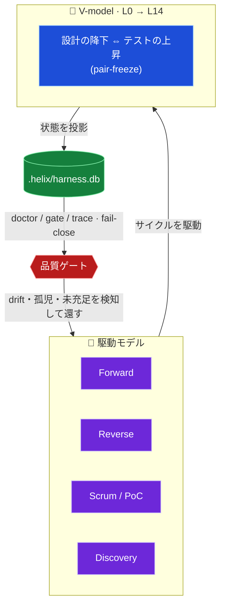
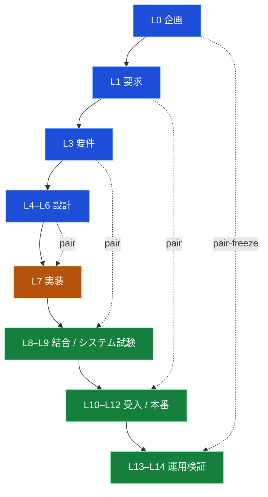
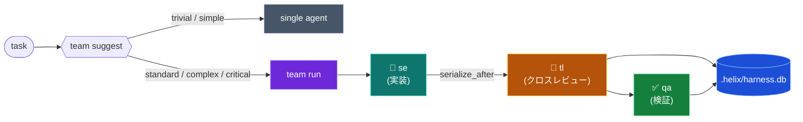

<div align="center">

# 🧬 HELIX — 超個人開発システム

### 人がつくるのは **モックまで**。要件は **承認するだけ**。<br>あとは AI が、ガードレールの内側で **完成まで自走する**。

**V-model** × **駆動モデル** × **HELIX DB** — 品質は宣言ではなく機械で守る。
provider の API キーは、リポジトリに置かない。

<br>


-orange?style=flat-square)

<sub><b>しばくべし</b> · <b>自律境界</b> · <b>10 本柱</b> · <b>コンセプト</b> · <b>V-model</b> · <b>駆動モデル</b> · <b>いまどこ</b> · <b>クイックスタート</b> · <b>コマンド早見表</b> · <b>検証</b></sub>

</div>

---

> [!IMPORTANT]
> **HELIX は「AI に個人開発を委譲するためのシステム」です。**
> 人は **企画・要求・モック** を決め、**要件を承認するだけ**。以降の設計・実装・検証・PR・CI・マージ・タグは、
> AI が **ガードレールの内側で完全自走** します。品質は「完了しました」という宣言ではなく、テストと証跡と
> 機械ゲートで守ります。
>
> - **非目標**: 人間チームの運用（velocity / sprint ceremony）。一方で **AI サブエージェントの分業は中核**（P2）。
> - 北極星 = `docs/design/helix/L0-charter/helix-charter_v0.1.md`（charter confirmed、10 本柱 P0–P9）。詳細は `CLAUDE.md`。
> - 本書のコマンドは HELIX の CLI 名 `helix` で表記しています。ローカルでは `bun run src/cli.ts <args>` で実行できます。

## 🔥 なぜ作ったのか

AI エージェントって、**とりあえず作ろうとする**じゃないですか。

しかも出来上がっても、こっちはコードを隅々まで読んでるわけじゃないじゃないですか。
だから後になって「うわ、これ…」ってなるやつ、絶対あるじゃないですか。

そういうの、いい加減 **しばき回したくなる** じゃないですか。
テストと証跡で締め上げて、「完了しました」を二度と鵜呑みにしない ── そんな仕組みが欲しかったんですよ。

そこまで縛れるなら、次はこう思うわけです。**ここまで縛れるなら、もう任せられるんじゃないか？** と。

—— それが **HELIX** です。しばく基盤の上でだけ、AI の全自走を解禁する。

> [!NOTE]
> 要するに HELIX は、**「AI の完了しましたをテストと機械チェックで殴り返す基盤」の上に、
> 「人はモックと承認だけ、あとは AI が PR・CI・マージ・タグまで完走する自走エンジン」を積んだもの** です。
> すべてローカルの TypeScript/Bun で回り、provider の認証は各公式 CLI 側に置いたまま。リポジトリは鍵を持ちません。

## 🥊 しばくべし AI の○○行動

AI の悪癖、あるあるじゃないですか。だから一個ずつ、対応する機能と柱で迎え撃つんですよ。

| しばくべき AI の○○行動 | これ、あるじゃないですか | しばく機能 | 柱 |
|---|---|---|:--:|
| 🤖 **完了詐称行動** | 「完了しました!」と言うが、証跡は無い | `helix doctor` / 厳格検証 ── テスト・証跡なしに完了を通さない | P3 |
| 🏃 **見切り発車行動** | 考えるより先に手が動き、とりあえず作る | `task classify` → `team suggest` ── 着手前に難易度と編成を判定 | P2 |
| 🧟 **書き逃げ行動** | 実装だけ済ませ、設計ドキュメントを残さない | **Reverse 駆動** `R0 → R4` で設計・要件を back-fill | P0 |
| 🪓 **越境行動** | スコープ外を触り、他人の編集を壊す | `serialize_after` + agent-guard +「他人の編集を revert しない」 | P2 |
| 🪞 **自画自賛行動** | 自分の実装を、自分でレビューして合格させる | **クロスレビュー** ── worker ≠ reviewer を別 provider に | P2 |
| 🏎️ **暴走行動** | 止まりどころを失い、逸脱したまま走り続ける | lock / budget time-cap / Recovery → **必ず Forward へ収束** | P0 |
| 💸 **富豪行動** | 何でも最上位モデルでぶん回す | 決定論的モデル選択 ── 難易度から model / effort を自動決定 | P2 |
| 🧠 **健忘行動** | 文脈を忘れ、引き継ぎが雑になる | `helix handover` + **2 層エージェントメモリ**（システム/プロジェクト） | P5·P7 |
| 🔑 **鍵ばらまき行動** | API キーやシークレットを平気でコードに書く | 鍵を持たない設計 ── provider 認証は公式 CLI 側、リポジトリに置かない | P8 |
| 📊 **見せかけ行動** | カウントは緑、でも中身が伴っていない | 「被覆 ≠ 中身」+ HELIX DB 投影 + doctor の fail-close | P9 |

## 🧑‍⚖️ 自律境界 — 人はどこまで、AI はどこから

HELIX の核心の一つは、**人と AI の境界を V-model 上で機械的に固定した**ことです。曖昧な「適宜レビュー」は存在しません。

| 工程 | 担当 |
|---|---|
| **L0 企画 / L1 要求 / L2 デザインモック** | **人が直接つくる**（モックが最後の直接関与） |
| **L3 要件定義** | **AI が起草、人は承認のみ** |
| **L4 設計 → L7 実装 → L14 運用検証 ＋ PR / CI / マージ / タグ** | **AI が完全自動**（不可逆操作のみ人へ escalate） |

```mermaid
flowchart LR
    subgraph HUMAN["🧑 人が直接つくる"]
        direction LR
        L0["L0 企画"] --> L1["L1 要求"] --> L2["L2 モック"]
    end
    subgraph GATE["🤝 AI 起草 · 人は承認のみ"]
        L3["L3 要件定義"]
    end
    subgraph AUTO["🤖 AI 完全自動"]
        direction LR
        L46["L4–L6 設計"] --> L7["L7 実装"] --> L814["L8–L14 検証"] --> GH["PR → クロスレビュー → CI → merge → tag"]
    end
    HUMAN --> GATE --> AUTO
    AUTO -.->|"不可逆操作のみ"| ESC["🧑 escalate"]

    classDef human fill:#b45309,stroke:#fcd34d,color:#fff;
    classDef gate fill:#6d28d9,stroke:#c4b5fd,color:#fff;
    classDef auto fill:#1d4ed8,stroke:#93c5fd,color:#fff;
    classDef esc fill:#b91c1c,stroke:#fca5a5,color:#fff;
    class L0,L1,L2 human;
    class L3 gate;
    class L46,L7,L814,GH auto;
    class ESC esc;
```



代表シナリオ: **人が要件・モックを凍結 → 以降ノータッチ → AI が設計〜実装〜検証〜PR〜クロスレビュー〜CI〜（失敗なら自動改善）〜マージ〜タグまで完走**。停止するのは gate 赤と不可逆操作の escalation だけ。

## 🏛️ スコープ — 10 本柱（P0–P9）

charter（L0、confirmed）が定める HELIX の全体スコープです。各柱は L1 HBR/HNFR → L3 FR/AC → L4–L6 設計へ降下済み。

| 柱 | 名前 | ひとこと |
|:--:|---|---|
| **P0** | 逸脱受け止めと Forward 収束 | 逸脱・障害・暴走を駆動 workflow で受け止め、**必ず Forward 正本へ戻す**。無人自走の安全弁 |
| **P1** | 要件承認後フル自動＋連続自律走行エンジン | heartbeat / job-queue / budget time-cap / fresh-session 再起動で**走り続ける**。大規模は Scrum 分割、版は version-up 定義で保全 |
| **P2** | オーケストレーション根本強化＋ループエンジニアリング | サブエージェントを「解釈 → 検証 → 計画 → 実行 → 検証 → 返却」の loop 単位で統括。worker ≠ verifier、effort/budget 制御、型付き agent↔tool 契約 |
| **P3** | 強い検証基盤 | 完全自動を許す安全の要。pair_closure（design⇔test 対凍結）・片肺禁止・機械 vs AI 判定境界・外部真実への照合 |
| **P4** | 自動保守システム | drift・劣化・不整合を自動検出 → 自動ルーティング → 自動修復。成功 recipe を学習し予防ルールへ昇格 |
| **P5** | コンテキスト効率向上 | 動的注入・圧縮で「必要分だけ」。閾値前に handover 要約 → fresh session 移行で長時間自走を支える |
| **P6** | GitHub 運用自動化 | commit/push のゲート化（全 gate PASS で authorized push）・PR クロスレビュー・CI 失敗の自動改善・タグ版管理 |
| **P7** | 2 層エージェントメモリ | システムメモリ（自己保守の根幹）＋プロジェクトメモリ。全エージェントが**同一記憶を共有**、Glossary を SSoT 化 |
| **P8** | 外部連携・外部検索（セキュリティ厳格） | 外部照合で思い込みを抑止、有益な知見はスキル化して自己拡張。すべて厳重なセキュリティ統制と escalation 境界の下で |
| **P9** | HELIX DB 収束 | 成果物（doc / code / test / PR）を台帳へ収束。**DB に収束しない成果は未完了** ── 「実装したつもり」を構造的に殺す |

## 🧬 コンセプト — 品質を守るサイクル

HELIX の核心は、**V-model** と **駆動モデル** が **HELIX DB** を通じてサイクルを回し、品質を機械的に守ることです。



> [!IMPORTANT]
> **宣言ではなく機械で守る。** 「被覆（ID 登録）」と「中身（descent）」を分け、未充足・孤児・drift を `doctor` が **fail-close** で止めます。カウントが通っても中身が無ければ通しません。DB に収束しない成果は **未完了**（P9）。

## 📐 V-model（L0 → L14）

設計の降下（左腕）とテストの上昇（右腕）が **pair-freeze** で 1 対 1 に対応します。片腕だけの前進（片肺）は禁止。



## 🚗 駆動モデル

タスクの性質に応じて、**招集する専門職とサイクル**を切り替えます。どの駆動で走っても、最後は Forward 正本へ収束します（P0 `forward_return`）。

| 駆動 | サイクル | 使いどころ |
|---|---|---|
| **Forward** | `plan → pair-freeze → implement → trace-freeze → review → accept` | 通常の前進開発 |
| **Reverse** | `R0 → R1 → R2 → R3 → R4 → Forward merge` | 既存実装から設計/要件を back-fill |
| **Scrum / PoC** | `S0 backlog → S1 plan → S2 poc → S3 verify → S4 decide` | 不確実性の検証・大規模の機能ユニット分割（P1） |
| **Discovery** | 必須 + 駆動モデル合成 → exit | メタ的な workflow 探索・triage |
| **Recovery / Troubleshoot** | 復旧 → 認識合わせ → 上流から修正 → fullback | 暴走・強制停止・前提崩れからの立て直し |

## 🔁 サブエージェント分業（P2 オーケストレーション）

人間チームの運用は非目標ですが、**AI サブエージェントの分業は HELIX の中核**です。worker と reviewer を
**別 provider** に割り当て、同一モデルによる自己承認を構造的に排除します。



- サブエージェントは **loop 単位**（プロンプトを複数視点で解釈・検証 → 計画 → 実行 → 検証 → orchestrator へ返却）で動く。
- どの provider surface（CLI / IDE / hosted API）でも **同じ guard・同じ状態遷移・同じ判定**（runtime parity）。
- effort / budget は決定論的に制御し、loop の暴走は time-cap で止める。

## 📈 いまどこ — 柱降下の現在地

HELIX の 10 本柱は V-model を **L0 から 1 層ずつ設計で降下**中です（bulk import はしない）。

| 層 | 成果物 | 状態 |
|---|---|:--:|
| **L0** 企画 | `docs/design/helix/L0-charter/helix-charter_v0.1.md` | ✅ confirmed |
| **L1** 要求 | `docs/design/helix/L1-requirements/pillar-requirements.md`（HBR/HNFR） | ✅ confirmed |
| **L3** 要件 | `docs/design/helix/L3-requirements/pillar-functional-requirements.md`（FR/AC） | ✅ confirmed |
| **L4–L6** 設計 | `docs/design/helix/L4-basic-design/` → `L5-detail/` → `L6-function-design/` | ✅ confirmed |
| **L7** 実装 | P2/P7 先行実装 green（loop engine・2 層メモリ・runtime bridge・型付き契約・effort budget・hosted preflight） | 🚧 進行中 |

最新の gap・drift・未充足は prose ではなく `helix status` / `helix doctor` / HELIX DB が正。

## 🚀 クイックスタート

```sh
bun install
bun run build

# ハーネス状態を受け取りたい既存プロジェクトのディレクトリで
helix setup project --dry-run
helix setup project
helix doctor
```

## ⚙️ セットアップ

HELIX project の bootstrap 入口は `helix setup project` です。初回導入時は `consumerReadiness` /
`importReport` / `postSetupWorkflow` を確認してください。

| シーン | コマンド |
|---|---|
| HELIX project 確認のみ（書き込まない） | `helix setup project --dry-run --json` |
| HELIX project 初期化 | `helix setup project` |
| チーム slugs 付き初期化 | `helix setup project --team --tl-team @org/tl --qa-team @org/qa --po-team @org/po` |

> `--tl-team` / `--qa-team` / `--po-team` は 3 つセットで指定します（CODEOWNERS の `@TODO` 混入防止）。

## 🗺️ コマンド早見表

| コマンド | 用途 |
|---|---|
| `helix setup project` | 対象リポジトリの HELIX project 初期化 |
| `helix status` | 実行モード検出（`standalone` / `claude-only` / `codex-only` / `hybrid`） |
| `helix doctor` | ガバナンス一括検証（gate / trace / drift / roadmap） |
| `helix db rebuild --json` | HELIX DB の再投影 |
| `helix plan lint` | PLAN の schema / 依存検証 |
| `helix review --uncommitted` | 未コミット変更のレビューパケット生成 |
| `helix task classify --text "…"` | タスク難易度の分類 |
| `helix skill suggest --plan <path>` | PLAN に対するスキル提案 |
| `helix team suggest --task "…"` | サブエージェント編成要否の判定 |
| `helix team run --definition <yaml>` | 編成 launch plan の構築 / 実行 |
| `helix handover` | ハンドオーバー（機械 + 明示）の生成 |
| `helix telemetry scan --json` | コストテレメトリの走査 |

<details>
<summary><b>📦 対象リポジトリへの導入（詳細）</b></summary>

<br>

現在の配布形態は、公開パッケージではなく、ソースチェックアウト / git 依存です。このチェックアウトから:

```sh
bun install
bun run build
```

次に、ハーネス状態を受け取りたい既存プロジェクトのディレクトリで setup を実行します:

```sh
helix setup project --dry-run --json
helix setup project
```

チームリポジトリの場合:

```sh
helix setup project --team --tl-team @org/tl --qa-team @org/qa --po-team @org/po
```

`setup project` は GitHub の workflow/テンプレート、VS Code task、`.helix/state/setup.json`、`.helix/memory`、
`.helix/handover`、`.helix/evidence` baseline を作ります。`--json` では `consumerReadiness` /
`importReport` / `postSetupWorkflow` を確認できます。

ブランチ保護はデフォルトでは emit のみ（出力するだけ）で、適用には明示的な人間 / 管理者の手順が必要です:

```sh
scripts/setup-branch-protection.sh
```

setup の経路には組み込みテンプレートがあるため、対象プロジェクトにこのリポジトリの `docs/templates/github` ツリーが存在する前でも実行できます。

</details>

<details>
<summary><b>⌨️ 日常コマンド</b></summary>

<br>

```sh
helix doctor
helix db rebuild --json
helix telemetry scan --json
helix team suggest --task "production security schema migration" --mode hybrid --json
helix team run --definition .helix/teams/team.yaml --mode hybrid --json
```

`--execute` は、provider CLI を実際に起動すべきときだけ使います:

```sh
helix team run --definition .helix/teams/team.yaml --mode hybrid --execute
```

</details>

<details>
<summary><b>🧩 編成定義（team YAML）</b></summary>

<br>

```yaml
name: speed-team
strategy: parallel
max_parallel: 2
members:
  - role: se
    engine: codex-se
    task: implement the adapter change
  - role: tl
    engine: pmo-sonnet
    task: review the adapter change
    serialize_after: se
```

任意のメンバーフィールド:

- `difficulty`: `trivial`、`simple`、`standard`、`complex`、`critical` のいずれか
- `model`: 明示的な model 上書き。受け付ける値は provider の ID / ファミリ: `gpt-*`、`claude-*`、`codex-*`、`haiku`、`sonnet`、`opus`、`local`
- `effort`: `low`、`medium`、`high` のいずれか

省略した場合、HELIX はタスクテキストから難易度を推論し、launch plan に `model_selection` を記録します。`serialize_after` は依存制御で、ランナーは依存先を先に並べ、依存先が失敗したら依存元をスキップします。

</details>

<details>
<summary><b>🤖 サブエージェントを起動するタイミング</b></summary>

<br>

タスクの出所が自由記述テキストのときは、`team run` の前に `team suggest` を使います:

```sh
helix team suggest --task "subagent runtime adapter refactor" --json
```

ポリシーは決定論的です:

- `trivial` と `simple` のタスクは、リスク用語を含まない限りシングルエージェントのままです。
- `standard`・`complex`・`critical` のタスクは、`hybrid` モードでクロス provider 編成を推奨します。
- `auth`、`database`、`doctor`、`migration`、`production`、`runtime`、`schema`、`security`、`subagent`、`windows` などのリスク用語は、`hybrid` モードで編成推奨を強制します。
- `hybrid` 以外のモードでは `should_launch=false` と `trigger="unavailable"` を返します。HELIX はクロス provider レビューを黙って偽装しません。
- `complex` と `critical` の推奨では、レビュアー作業を実装の後ろに直列化します。`critical` ではさらに QA 検証者を追加します。

返される `definition` は `.helix/teams/<name>.yaml` として保存するか、`team run` が使うのと同じスキーマに渡せます。

</details>

<details>
<summary><b>🔐 Provider 境界</b></summary>

<br>

model が選択されている場合、HELIX は各 provider CLI をそのネイティブ起動形（実装エンジンごとの exec / model / effort フラグ）で立ち上げます。effort は決定論的に選択し、フラグが確定するまでは証跡 / プロンプトのメタデータに記録します。

managed なアダプタ呼び出しでは、HELIX は raw-provider ガード用の環境マーカーを provider 実行前に**剥がし、それらを渡しません**。provider の認証情報は各公式 CLI のログインが保持し続けます。

</details>

## ✅ 検証

```sh
bun run typecheck
bun run lint
bun run test
bun run test:node-fallback
helix doctor
```

> [!TIP]
> plan やドキュメントの変更後に HELIX DB が古くなっている場合、`doctor` は失敗する想定です。
> `helix db rebuild --json` で投影を再構築してから `doctor` を再実行してください。

<div align="center">
<br>
<sub><b>HELIX</b> — 超個人開発システム · TypeScript core<br>人が上流を決めれば、あとは AI がガードレール内で完成まで自走する。</sub>
</div>
