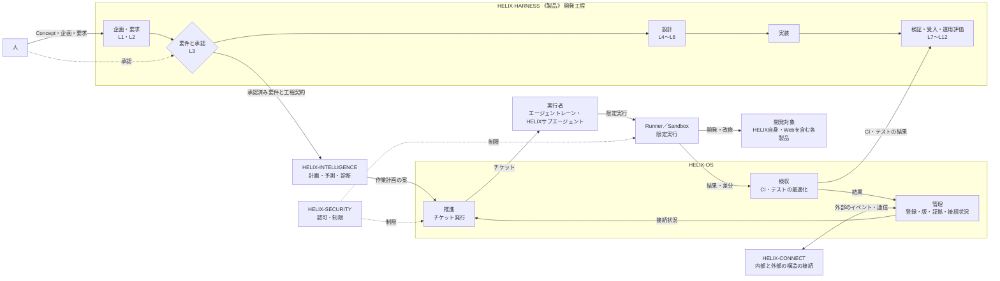
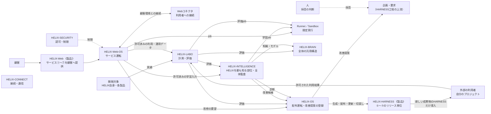

# HELIX Concept

## 1. どんなシステムか

HELIXは、人が決めた価値と要求を起点に、AIが開発・検証・運用・改善を自走する開発システムである。
同じ開発能力を、HELIX自身と複数の製品へ適用し、その実績から製品とHELIXの両方を育て続ける。
内部で実証した能力は、Webを通じて顧客にも提供する。

中心価値は、**ソフトウェアの所有者が、自分のシステムを自分で育て続けられること**にある。

| 担い手 | 持つもの |
|---|---|
| 人 | 価値、企画、要求、体験、要件の承認、不可逆な操作の許可 |
| HELIX（AI） | 承認された範囲の分解、設計、実装、検証、統合、運用、改善候補づくり |

## 2. どんな構想か

### 5大目標

1. **システム駆動エージェント自走システム** — 会話や記憶ではなく、上流の決定と工程契約に沿ってAIが自走する。
2. **開発するほど賢くなる自己知能型改善システム** — 実績を計測し、知識とモデルを育てる。学習結果が要求や承認を直接書き換えない。
3. **設計から全体をシミュレーションする予測型システム** — 設計と状態から影響を予測し、前提と不確実性を示して実測と照らす。
4. **CIとbotで品質とスピードを両立した非エンジニアでも作れるシステム** — 自動検査と差戻しを、人が目的・進行・判断事項を理解できる入口へつなぐ。
5. **低コストワーカでも最高のパフォーマンスを発揮して最適配置するシステム** — 品質・費用・手戻りの実測で配置を決め、名前や価格だけで決めない。

### 成長の循環

1. HELIXでHELIX自身を開発・改修する。稼働版で候補版を作り、独立評価の後に段階的に適用し、問題があれば稼働版へ戻す。
2. 同じ開発能力を、性質の異なる複数の製品へ投入する。
3. 製品の結果はまずその製品へ戻し、HELIX側の欠陥はHELIXの自己改善へ戻す。
4. 内部で実証した開発・保守改修の能力を、Webで顧客へ提供する。
5. 許可されたWebデータを計測・学習し、改善したHELIXを内部利用とWeb提供へ戻す。

HELIXの能力を投入する先はWebだけではない。HELIX-FACTORY、HELIX-MARKETINGのような別事業も、同じ能力を使う事業構想として扱う。
これらの事業構想があることを、新しい機構、共通DB、顧客データの共有を作る根拠にはしない。

### 版ごとの到達範囲

HELIXは、本体の能力、Webでの提供、利用者の自立の3つの軸で育つ。1.0以降は、本体とWebが別々に進み、能力の受渡しで交差する。
版は能力進化の節目であり、公開ソフトウェアの版番号ではない。後の版の能力そのものを、前の版の完成条件には持ち込まない。
機構は版が上がるにつれて加わる。後から加わる機構が使う記録と接続は、1.0から土台として入れておく（下の「1.0から入れる土台」）。

| 版 | HELIX本体でやること | Web提供でやること | 利用者ができるようになること | 加わる機構 | 到達の確かめ方 |
|---|---|---|---|---|---|
| 1.0 | HARNESS Version 1の完成。要求から設計・実装・検証・統合・リリース・運用・保守まで通し、変更を適切な地点へ戻せる。HELIX自身の改善も同じ経路で行う | Web展開を始めるための開発基盤と提供package | 定型保守を開くための基礎 | HARNESS、OS、BRAIN、LABO、INTELLIGENCE、SECURITY、Runner／Sandbox、CONNECT | 性質の異なる複数の製品とHELIX自身で、要求から受入・運用評価まで成立する。部品の存在や文書だけで完成としない |
| 1.x | 実案件でpackageと並行開発を磨く | Webコネクタ型AI開発SaaS。利用者のPC・WSL・VPS・リポジトリをWebから操作する | 限定された更新・診断・復旧 | Web、Web-OS | 利用者環境で接続・job・切断・取消・再開が成立する。開発engineをWeb用に別実装しない |
| 2.0 | LABOが外の情報を分解し、使える構造をBRAINへ入れる。取り込んだ構造から、今の案件へ根拠付きで推薦する。外の情報は、OSS、設計資料、論文、Issue、PR等である（下の注記） | 技術・設計・改修の根拠付き推薦を提供する | 影響と選択肢を見て変更を判断する | なし（LABOを外の情報の分解と推薦の効果の評価へ、BRAINを取り込んだ構造の蓄積へ拡張） | 推薦から出典・版・根拠へ戻れる。適用不能や保留も返せる。外部の成功を自分の環境の成功にすり替えない |
| 3.0 | HELIXの開発データで、ローカルLLMを学習・チューニング・評価する | HELIX-Web 3：HDA。調整済みモデルを分散サーバーから呼び出して開発を補助する | 専門AIと保守・改修を進める | なし（INTELLIGENCEをローカルモデルの学習へ拡張） | どのデータと設定から生まれたモデルかを追える。学習前と比べ、弱点・適用範囲・撤回先を持つ |
| 4.0 | BRAIN・HELIX-HARNESS-CORE・INTELLIGENCE・OSの複合処理で、案件ごとに開発フローを組み立て、途中結果で再計画する | 目的・計画・根拠・進行をWebから扱う | 要望から改修手順を組ませ、実行を任せる | なし（BRAIN・HELIX-HARNESS-CORE・INTELLIGENCE・OSの複合処理として開発フローを組む） | 未知の案件でも必要な義務を落とさない計画を作れる。推論が誤っても、権限・品質・安全の検査で実行を止められる |
| 5.0 | System Compiler。人と要件を一緒に定め、確定後はシステム一式を納品する | 共同定義・プレビュー・コンパイル・検収・配備の体験 | 要求を変え、既存システムを差分で作り直して育てる | なし（全機構の組合せ） | 対象を限定して、共同定義から納品まで成立する。改修は全再生成ではなく検証可能な差分更新で行う |

利用者の自立の到達版は目安であり、時期を固定しない。改修の難易度は一つにまとめず、操作の種類ごとに確かめてから開く。

機構の増え方:

```mermaid
flowchart LR
    subgraph V10["1.0 HARNESSの完成"]
        H1["HELIX-HARNESS 《製品》"]
        O1["HELIX-OS"]
        B1["HELIX-BRAIN<br/>全体の汎用構造"]
        I1["HELIX-INTELLIGENCE<br/>既存の外部モデルで稼働中の判断"]
        L1["HELIX-LABO<br/>計測・改善の効果と退行の評価"]
        S1["HELIX-SECURITY"]
        R1["Runner／Sandbox"]
        C1["HELIX-CONNECT"]
    end
    subgraph V1x["1.x Web提供の開始"]
        W1["HELIX-Web 《製品》"]
        WO1["HELIX-Web-OS"]
    end
    subgraph V20["2.0 根拠付きの推薦"]
        L2["LABOの拡張<br/>外の情報の分解、推薦の効果と退行の評価"]
        B2["BRAINの拡張<br/>取り込んだ構造の蓄積"]
    end
    subgraph V30["3.0 学習"]
        I3["INTELLIGENCEの拡張<br/>ローカルLLMの学習"]
    end
    subgraph V40["4.0 動的な開発フロー"]
        B4["BRAIN・HELIX-HARNESS-CORE・INTELLIGENCE・OSの連動<br/>開発フローを組む"]
    end
    subgraph V50["5.0 System Compiler"]
        SC["全機構の組合せ<br/>共同定義から納品まで"]
    end
    V10 --> V1x --> V20 --> V30 --> V40 --> V50
```

INTELLIGENCEは1.0からあり、既存の外部モデルで稼働中の理解・計画・予測・診断・レビュー・配置案を行う。3.0でローカルLLMの学習・チューニング・評価へ広がる。
BRAINも1.0からあり、HELIX全体の汎用の構造（設計パターン、設計ユニット・パーツ）を持つ。2.0では、LABOが外の情報を分解した構造を取り込む。
4.0の開発フローの組み立ては、BRAIN・HELIX-HARNESS-CORE・INTELLIGENCE・OSの複合処理として行う。INTELLIGENCEが計画の候補を出し、OSがそれを登録して進める（2026-09-26、[INTELLIGENCEの判断記録](../governance/decisions/intelligence-l1-idea-po-decisions-2026-09-26.md)）。
HELIXの機能は、個々の機構に割り振るのではなく、各機構が連動することで生まれるように作る。その到達点が5.0のSystem Compilerである。
2.0の「外の情報」は、OSS、設計資料、論文、Issue、PR等である。INTELLIGENCEのクローラーやCONNECT等が取得し、LABOが出所を確かめて分解・比較・実験し、汎用の構造の候補としてBRAINへ入れる。外で成功した方式をそのままBRAINへ入れない（2026-09-26、[LABOの判断記録](../governance/decisions/labo-core-engine-po-decisions-2026-09-26.md)）。
LABOも1.0からあり、HELIX自身や製品の改善が効いたか、退行していないかを独立して評価する。2.0では推薦の効果の評価へ広がる。

### 1.0から入れる土台

後の版で必要になるものを、後から付け足すのではなく1.0の時点で仕組みに入れておく。記録していないデータは、後から学習や評価に使えない。

| 土台 | 1.0で入れること | 使う版 |
|---|---|---|
| ログと証拠 | すべての機構が共通の形で記録する。誰が・何を・どの要求と構成の版で・どの能力とモデルの版を使い・どうなったかを、相関IDで結ぶ。要求、判断、変更、検証、手戻り、結果を一つの開発の経過（episode）として辿れるようにする | 1.0の計測と復旧、2.0の推薦の実績、3.0の学習データ、4.0の判断根拠 |
| データの利用区分 | 記録する時点で、出典、権利、機密区分、学習や外部送信に使ってよいかを付ける。学習用と評価用を分けられるようにする | 3.0の学習、Web提供でのデータ還流 |
| 計測 | 品質、費用、時間、再作業、失敗を、作業と構成の版ごとに測る | 1.0のWorker配置、以降すべての改善の比較 |
| 接続契約と版 | 機構どうし、外部とのやりとりに、能力名、契約版、対象範囲、相関ID、期限、冪等キー、結果状態を持たせる。未対応の版を黙って読み替えない | 機構の追加と交換、1.xのConnector、2.0の外部データ |
| 隔離の単位 | project、tenant、環境を、すべての記録、権限、データ、資源に最初から付ける | 1.xのWeb提供、複数製品の並行開発 |
| 構成版の固定と切戻し | 実行中のjobが使っている能力、モデル、構成の版を固定して記録し、候補版の段階適用と切戻しをできるようにする | HELIXの自己更新、3.0以降のモデル差し替え |
| 後から加わる機構の受け口 | 機構どうしの入出力を接続契約で定め、後から加わる機構が使う入出力（評価用の計測、学習用の記録など）も1.0から記録しておく。1.0でHELIX-LABOを作るため、BRAINとINTELLIGENCEを1.0からコネクタで接続できるようにしておく | 1.0のLABOとINTELLIGENCE |

## 3. どんな機構で成り立つか

HELIXは、全版を通じて8つの機構と2つの共通部品から成る。機構は版ごとに加わる。**製品は機構の一部**であり、HARNESSとWebだけが製品の属性を持つ。
以下の図と表は、すべての機構がそろった姿を示す。
機構を分けるのは、成長の循環を切らずに各機構を交換・更新できるようにするためである。機構や文書の数を増やすことは目的にしない。
全体の統制は、すべての書き込みを一か所に集める万能の中枢ではない。各機構が自分のデータと責務を持つ。

### 開発の流れ

人は要求を工程の起点へ入れ、要件を承認する。承認後の設計から検証までは、AIが工程に沿って自走する。

### 提供と改善

HARNESSはリリース単位ごとに外部の利用者へ、開発能力はWebを通じて顧客へ提供する。どちらの利用結果も、許可された範囲で改善へ戻す。

### 機構の役割

| 機構 | 役割 | しないこと |
|---|---|---|
| HELIX-HARNESS 《製品》 | V-model、要求形成・設計・検証・受入の契約、外部へ提供する開発基盤 | 作業の割当、実行状態の管理 |
| HELIX-OS | 製品ごとの固有性を持ち、工程管理と推進を担う。管理（HELIX自身と各製品の要求・承認・予算・状態・証拠の登録と版の管理）、推進（接続状況から安全な順序を決めてチケットを発行し、エージェントレーンとHELIXサブエージェントへ割り当てる）、検収（チケットから必要なCIとテストを割り出して最適化する）、統合、更新、復旧 | 工程の意味の別定義、INTELLIGENCEの案の無条件実行 |
| HELIX-BRAIN | 製品単位ではなく、HELIX全体に共通する汎用性を持つ。汎用の構造（設計パターン、設計ユニット・パーツ）を持ち、意味から構造を取り出す。BRAINの「学習」は、LABOが複数の製品やepisodeから確かめた汎用の構造の候補を蓄えることである。モデルの学習・チューニング・評価は、3.0以降にINTELLIGENCEがLABOの材料を使って行う（2026-09-26、[LABOの判断記録](../governance/decisions/labo-core-engine-po-decisions-2026-09-26.md)）。各製品のHELIX-HARNESS-COREとコネクタで接続し、コアのパターンからパーツを増やす | 製品固有の意味・設計の保持、要求・承認・権限の生成、OS状態の直接更新 |
| HELIX-LABO | 実験、比較、改善効果・退行の計測 | 自己評価だけでの採用確定 |
| HELIX-INTELLIGENCE | HELIXについて最も知っている部位。稼働中の理解、計画、予測、診断、レビュー、配置案を、1.0から既存の外部モデルで行い、後の版でローカルLLMに判断を依頼する。バグbot、ヘルプbot、クローラーを発行し、HELIX全体の監査に寄せる。バグbotは、CIでよく失敗する種類のログがたまり、機械で判定できるようになったものから発行する | 検証なしでの稼働モデル差し替え |
| HELIX-SECURITY | 認可、情報保護、資格情報、隔離、失効 | 自身の権限の拡張 |
| HELIX-Web 《製品》 | HARNESSのサービス①〜⑦をリリース単位として顧客へ提供し、顧客が欲しい成果物を選んで受け取る窓口 | 開発エンジンの別実装 |
| HELIX-Web-OS | 顧客のtenant・job・サービス状態・配備・監視・復旧 | 内部OSの状態・鍵・権限の共有 |
| HELIX-CONNECT（共通部品） | HELIXの内部と外部の構造をつなぐ。内部の機構どうしの接続（HELIX-HARNESS-COREとBRAIN、BRAINとINTELLIGENCE等）と、外部との接続を担う。接続登録、契約版の照合、通信、再送、追跡。利用者に提供する接続は、別のWebコネクタとする | 業務判断、承認 |
| Runner／Sandbox（共通部品） | 限定された実行、停止、隔離、結果回収 | 作業の採否、自己承認 |

- **BRAINは全体、OSは製品ごと。** HELIX全体に共通する汎用の構造（設計パターン、設計ユニット・パーツ）はBRAINが持ち、製品ごとの工程管理と推進はOSが担う。INTELLIGENCEはHELIXについて最も知っている部位として、稼働中の判断と、バグbot・ヘルプbot・クローラーの発行を担い、HELIX全体の監査に寄せる。
- **決めるのはOS。** INTELLIGENCEは案を出す。OS内の推進機構はoperational tag、HARNESS語彙へのversioned mapping、composition、workflow instanceの生成規則を所有し、案の適格性を確認してticket graphとworkflow instanceを生成する。OSの管理が登録・統制して状態遷移を確定し、検収はHARNESSの契約への充足を独立して確認する。
- **管理・推進・検収を、同じ自己承認主体にまとめない。**
- **チケットは、管理・推進・検収をつなぐ単位である。** 管理が接続状況を持ち、推進がチケットを発行し、実行者が作業し、検収が必要な検証を決め、管理が結果を記録する。
- 開発の層は、Concept → 企画（L1）→ 要求（L2）→ 要件（L3）→ 設計（L4〜L6）→ 実装 → 検証（L7〜L10）→ 利用者受入（L11）→ 運用評価（L12）の順に進み、`L1↔L12`、`L2↔L11`、`L3↔L10`、`L4↔L9`、`L5↔L8`、`L6↔L7`で対にする。

### HELIX-HARNESS

HELIX-HARNESSは、サービス①〜⑦をすべて統合したものである。各サービスは、それぞれ独立して成立し、単独で使え、単独でリリースできるように作る。
独立して成立することと単独でリリースできることは、各サービスの要求、依存、受入で確かめる。
利用者は欲しい成果物のサービスだけを導入してもよく、統合されたHELIX-HARNESSとして開発全体に使ってもよい。
各サービスは要求・設計・実装・テスト・検証を一式持ち、互いに密結合させない。密結合にすると、単独でリリースできなくなるためである。
同じサービス①〜⑦を、HELIX-Webがリリース単位として顧客へ提供する。
対象製品の言語、AIのprovider、CI製品、画面の方式には依存しない。

#### 製品群（サービス①〜⑦、リリース単位）

| サービス | 利用者が受け取る成果物 |
|---|---|
| ① 画面プロト／PoC | 画面の試作（HTML）、実現できるかの検証（PoC） |
| ② 要件定義 | 要件定義の書類 |
| ③ 設計 | 設計書 |
| ④ 開発 | ミスなく作られたコード |
| ⑤ リファクタリング | 境界を保ったきれいなコード |
| ⑥ リリース | リリースの仕組み（インフラ） |
| ⑦ 運用保守 | ログを取り、改善し続ける仕組み |

#### サービスを支えるもの

| 区分 | 中身 |
|---|---|
| 入口：フルリバース | 持ち込まれた既存の要件、コード、PoCをHELIXの形へ変換する。どのリリース単位からでも入れる |
| 枠：開発方式 | Vモデル（ウォーターフォールの単独製品型）、スクラム（最小の製品で市場投入を急ぎ、利用の記録から改善していく市場投入先行方式）、ハイブリッド（Vモデルを土台に、1つの開発工程から多くのユニット拡張単位へ広げ、1つのコア製品と複数の製品を最後に結合する）、リリースカンバン（リリース段階をv1、v2、v3と切りながら、最終的なプロダクトゴールへ進む）。製品特性に合わせて合成できる。L3までは方式によらず一律共通に進める。層とV字の対、Gate。リリース単位を工程として並べ、並べたところに接続要求が生まれる |
| 部品 | 要求エンジン、デザインHARNESS、リサーチWorkflow、Design Template。複数のリリース単位から使う |
| コア（HELIX-HARNESS-CORE） | 製品固有の意味と設計を持つ。要求・設計・実装・テストの追跡、依存、古くなった箇所の検出、意味の正本と意味コア、テスト、CIの仕組み。すべてのリリース単位を横断して成立させる。意味と設計はHELIX-JSONで管理し、Pythonで要求を導出する。BRAINとはコネクタで接続する |

- 要求は、リリース単位ごとの単体要求、枠に並べたときの受渡しの接続要求、開発全体の構成体要求に分ける。
- 設計テンプレから設計パターンを導き、設計ユニット・パーツとして取り入れる。「こういうシステムにはこういう設計が必要だから要求で聞いておく」という形で、要求エンジンが必要な入力を質問する。これにより多様な仕組みに対応する。起点の資料は、旧HELIXでコアのベースにしていたハイブリッド設計ドキュメント（[参照用archive](../../archive/reference-sources/README.md)）である。
- 設計ユニット・パーツとその依存から、工程表、遷移図、実装の優先順位を導く。
- HELIX-HARNESS-COREのパターンをBRAINへ戻すと、BRAINはパーツを増やし、次の製品で使える。製品が増えるほどHELIX全体が賢くなる。
- 個別のticketの発行、Workerの実行、検収は、OSの推進と検収が担う。HARNESSには含めない。
- Worker pool、HELIXの内部memory、運用DB、CIの運転、学習の履歴を、利用者の必須構成にしない。HELIX自身を育てる部分（全体統制、学習、LABO、INTELLIGENCE）は同梱しない。
- 配布する道具、道具で作る製品、学習済みモデルは別の成果物とする。配布物の生成・配布・切戻しはOSが運転する。
- Version 1には、サービス①〜⑦のすべてを含める。各サービスが単独で成り立ち、つなげて開発全体に使えることを1.0の完成とする。
- HELIX-Webで利用者へ渡す成果物は、デザインならHTML、設計ならMarkdown、実装ならきれいなコードである。HELIX-HARNESS-COREのJSONとPythonは公開しない。利用者が作ったシステムの原本はHELIXが保有する。原本は後で解体してパターンだけを取り込み、破棄する。利用規約には「HARNESSの改善に利用することがあります」程度を示す。

## 4. 原則

1. **人が決める** — 要求、承認、判断を、誰が・何に・どの版で行ったかに結びつける。
2. **責務を分ける** — 機構ごとの責務と、製品固有の価値・要求を混ぜない。
3. **上から下へ導く** — Conceptから要求、要件、設計、実装、運用へ一方向に導く。
4. **責任者は一つ** — 一つの振る舞いには、主たる責任者を一つだけ置く。
5. **AIの実行を縛る** — Workerを、割当、branch、期限、予算、権限の範囲で動かす。
6. **証拠で閉じる** — 対象の版、実体、独立レビュー、結果の読み直しで完了を判定する。
7. **再構築できる** — 意味の正本、実行事実、表示、作業文脈を分けて保つ。
8. **学びは候補として戻す** — 学習や監査の結果は上流への提案とし、正本を直接書き換えない。
9. **検証済みの単位で出す** — 検証済みの機能から提供構成を組み、releaseとdeploymentを分ける。

守ること:

- Issue、PR、CI、会話から、要求の意味や人の承認を生み出さない。
- 不明を「問題なし」に読み替えない。
- 自分の作業を自分でレビューして、独立レビューの代わりにしない。
- 要求・実装・検証・受入・運用を、一つの「完了」にまとめない。
- project・tenant・環境ごとに、状態・権限・データ・学習許可・資源を分け、暗黙に共有しない。
- 機構の停止や交換で、認可・品質・証拠・復旧条件を失わない。
- Webの画面表示だけで、開発サービスが成立したとみなさない。
