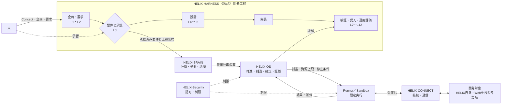
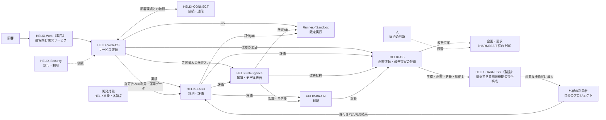

# HELIX Concept

> 版: v4.3 ／ status: current
> HELIXがどんなシステムで、どんな構想を持ち、どんな機構で成り立つかを定める。本書は他の文書を参照しない。
> 製品定義・要求・目標や原則の詳細は、本書に紐づけて下位に置く。版ごとにファイルを分けず、本ファイルをその場で改訂する。
>
> 改訂履歴
> - v4.3 (2026-09-24) — 8機構＋2共通部品へ再編した。HELIX自身・複数製品・Web提供・データ還流の循環を明示した。1ファイルでその場改訂する形へ移行した。
> - v4.2 (2026-09-24) — 自走、全体simulation、非エンジニア利用、Worker最適配置の責務を明確化した。
> - v4.1 (2026-09-17) — HARNESS、OS、Web、Web-OSを分離した。

## 1. どんなシステムか

HELIXは、人が決めた価値と要求を起点に、AIが開発・検証・運用・改善を自走する開発システムである。
同じ開発能力を、HELIX自身と複数の製品へ適用し、その実績から製品とHELIXの両方を育て続ける。
内部で実証した能力は、Webを通じて顧客にも提供する。

中心価値は、**ソフトウェアの所有者が、自分のシステムを自分で育て続けられること**にある。

| 担い手 | 持つもの |
|---|---|
| 人 | 価値、企画、要求、体験、要件の承認、不可逆な操作の許可 |
| HELIX（AI） | 承認された範囲の分解、設計、実装、検証、統合、運用、改善候補づくり |

## 2. どんな構想か

### 5大目標

1. **システム駆動エージェント自走システム** — 会話や記憶ではなく、上流の決定と工程契約に沿ってAIが自走する。
2. **開発するほど賢くなる自己知能型改善システム** — 実績を計測し、知識とモデルを育てる。学習結果が要求や承認を直接書き換えない。
3. **設計から全体をシミュレーションする予測型システム** — 設計と状態から影響を予測し、前提と不確実性を示して実測と照らす。
4. **CIとbotで品質とスピードを両立した非エンジニアでも作れるシステム** — 自動検査と差戻しを、人が目的・進行・判断事項を理解できる入口へつなぐ。
5. **低コストワーカでも最高のパフォーマンスを発揮して最適配置するシステム** — 品質・費用・手戻りの実測で配置を決め、名前や価格だけで決めない。

### 成長の循環

1. HELIXでHELIX自身を開発・改修する。稼働版で候補版を作り、独立評価の後に段階的に適用し、問題があれば稼働版へ戻す。
2. 同じ開発能力を、性質の異なる複数の製品へ投入する。
3. 製品の結果はまずその製品へ戻し、HELIX側の欠陥はHELIXの自己改善へ戻す。
4. 内部で実証した開発・保守改修の能力を、Webで顧客へ提供する。
5. 許可されたWebデータを計測・学習し、改善したHELIXを内部利用とWeb提供へ戻す。

### 版ごとの到達範囲

HELIXは、本体の能力、Webでの提供、利用者の自立の3つの軸で育つ。1.0以降は、本体とWebが別々に進み、能力の受渡しで交差する。
版は能力進化の節目であり、公開ソフトウェアの版番号ではない。後の版の能力そのものを、前の版の完成条件には持ち込まない。
ただし、後の版が使う土台は1.0から入れる（下の「1.0から入れる土台」）。10の機構は1.0から境界と差し込み口を持ち、版ごとに中身が育つ。

| 版 | HELIX本体でやること | Web提供でやること | 利用者ができるようになること | 主に育つ機構 | 到達の確かめ方 |
|---|---|---|---|---|---|
| 1.0 | HARNESS Version 1の完成。要求から設計・実装・検証・統合・リリース・運用・保守まで通し、変更を適切な地点へ戻せる。HELIX自身の改善も同じ経路で行う | Web展開を始めるための開発基盤と提供package | 定型保守を開くための基礎 | HARNESS、OS、BRAIN、Runner、Security、LABO | 性質の異なる複数の製品とHELIX自身で、要求から受入・運用評価まで成立する。部品の存在や文書だけで完成としない |
| 1.x | 実案件でpackageと並行開発を磨く | Connector型AI開発SaaS。利用者のPC・WSL・VPS・リポジトリをWebから操作する | 限定された更新・診断・復旧 | Web、Web-OS、CONNECT | 利用者環境で接続・job・切断・取消・再開が成立する。開発engineをWeb用に別実装しない |
| 2.0 | 外部の開発データ（OSS、設計資料、Issue、PR、文書、研究）を分解し、今の案件へ根拠付きで推薦する | 技術・設計・改修の根拠付き推薦を提供する | 影響と選択肢を見て変更を判断する | BRAIN、CONNECT、Security | 推薦から出典・版・根拠へ戻れる。適用不能や保留も返せる。外部の成功を自分の環境の成功にすり替えない |
| 3.0 | HELIXの開発データで、ローカルLLMを学習・チューニング・評価する | HELIX-Web 3：HDA。調整済みモデルを分散サーバーから呼び出して開発を補助する | 専門AIと保守・改修を進める | Intelligence、LABO、Runner、Web-OS | どのデータと設定から生まれたモデルかを追える。学習前と比べ、弱点・適用範囲・撤回先を持つ |
| 4.0 | 調整したモデルを判断能力に組み込み、案件ごとに開発フローを組み立て、途中結果で再計画する | 目的・計画・根拠・進行をWebから扱う | 要望から改修手順を組ませ、実行を任せる | BRAIN、Intelligence、OS | 未知の案件でも必要な義務を落とさない計画を作れる。推論が誤っても、権限・品質・安全の検査で実行を止められる |
| 5.0 | System Compiler。人と要件を一緒に定め、確定後はシステム一式を納品する | 共同定義・プレビュー・コンパイル・検収・配備の体験 | 要求を変え、既存システムを差分で作り直して育てる | HARNESS、BRAIN、OS、Web | 対象を限定して、共同定義から納品まで成立する。改修は全再生成ではなく検証可能な差分更新で行う |

利用者の自立の到達版は目安であり、時期を固定しない。改修の難易度は一つにまとめず、操作の種類ごとに確かめてから開く。

### 1.0から入れる土台

後の版で必要になるものを、後から付け足すのではなく1.0の時点で仕組みに入れておく。記録していないデータは、後から学習や評価に使えない。

| 土台 | 1.0で入れること | 使う版 |
|---|---|---|
| ログと証拠 | すべての機構が共通の形で記録する。誰が・何を・どの要求と構成の版で・どの能力とモデルの版を使い・どうなったかを、相関IDで結ぶ。要求、判断、変更、検証、手戻り、結果を一つの開発の経過（episode）として辿れるようにする | 1.0の計測と復旧、2.0の推薦の実績、3.0の学習データ、4.0の判断根拠 |
| データの利用区分 | 記録する時点で、出典、権利、機密区分、学習や外部送信に使ってよいかを付ける。学習用と評価用を分けられるようにする | 3.0の学習、Web提供でのデータ還流 |
| 計測 | 品質、費用、時間、再作業、失敗を、作業と構成の版ごとに測る | 1.0のWorker配置、以降すべての改善の比較 |
| 接続契約と版 | 機構どうし、外部とのやりとりに、能力名、契約版、対象範囲、相関ID、期限、冪等キー、結果状態を持たせる。未対応の版を黙って読み替えない | 機構の追加と交換、1.xのConnector、2.0の外部データ |
| 隔離の単位 | project、tenant、環境を、すべての記録、権限、データ、資源に最初から付ける | 1.xのWeb提供、複数製品の並行開発 |
| 構成版の固定と切戻し | 実行中のjobが使っている能力、モデル、構成の版を固定して記録し、候補版の段階適用と切戻しをできるようにする | HELIXの自己更新、3.0以降のモデル差し替え |
| 機構の差し込み口 | 10の機構すべてに、境界と入出力の契約を1.0で定める。まだ中身が育っていない機構も、受け口と記録だけは置く | 各版で機構を育てるとき |

## 3. どんな機構で成り立つか

HELIXは8つの機構と2つの共通部品から成る。**製品は機構の一部**であり、HARNESSとWebだけが製品の属性を持つ。
機構を分けるのは、成長の循環を切らずに各機構を交換・更新できるようにするためである。機構や文書の数を増やすことは目的にしない。
全体の統制は、すべての書き込みを一か所に集める万能の中枢ではない。各機構が自分のデータと責務を持つ。

### 開発の流れ

人は要求を工程の起点へ入れ、要件を承認する。承認後の設計から検証までは、AIが工程に沿って自走する。

### 提供と改善

HARNESSは必要な開発機能を選べる形で外部の利用者へ、開発能力はWebを通じて顧客へ提供する。どちらの利用結果も、許可された範囲で改善へ戻す。

### 機構の役割

| 機構 | 役割 | しないこと |
|---|---|---|
| HELIX-HARNESS 《製品》 | V-model、要求形成・設計・検証・受入の契約、外部へ提供する開発基盤 | 作業の割当、実行状態の管理 |
| HELIX-OS | HELIX自身と各製品の要求・承認・予算・状態の管理、割当、統合、更新、復旧、推進 | 工程の意味の別定義、BRAIN案の無条件実行 |
| HELIX-BRAIN | 稼働中の理解、計画、予測、診断、レビュー、配置案 | 要求・承認・権限の生成、OS状態の直接更新 |
| HELIX-LABO | 実験、比較、改善効果・退行の計測 | 自己評価だけでの採用確定 |
| HELIX-Intelligence | 経験・知識・判断方法・モデルの改善 | 検証なしでの稼働モデル差し替え |
| HELIX-Security | 認可、情報保護、資格情報、隔離、失効 | 自身の権限の拡張 |
| HELIX-Web 《製品》 | 顧客向けの開発・保守改修サービス | 開発エンジンの別実装 |
| HELIX-Web-OS | 顧客のtenant・job・サービス状態・配備・監視・復旧 | 内部OSの状態・鍵・権限の共有 |
| HELIX-CONNECT（共通部品） | 接続登録、契約版の照合、通信、再送、追跡 | 業務判断、承認 |
| Runner／Sandbox（共通部品） | 限定された実行、停止、隔離、結果回収 | 作業の採否、自己承認 |

- **BRAINは考え、Intelligenceは育てる。** 稼働時の判断はBRAIN、その判断能力を育てるのはIntelligenceである。
- **決めるのはOS。** BRAINは案を出し、OS内の推進機構が作業を生成し、OSの管理が確定する。検収は独立して行う。
- **管理・推進・検収を、同じ自己承認主体にまとめない。**
- 開発の層は、Concept → 企画（L1）→ 要求（L2）→ 要件（L3）→ 設計（L4〜L6）→ 実装 → 検証（L7〜L10）→ 利用者受入（L11）→ 運用評価（L12）の順に進み、`L1↔L12`、`L2↔L11`、`L3↔L10`、`L4↔L9`、`L5↔L8`、`L6↔L7`で対にする。

### HELIX-HARNESSの提供の考え方

HARNESSは一つの塊として提供しない。利用者は必要な開発機能だけを選び、明示された依存とともに導入する。
HELIX自身を育てる部分（全体統制、学習、LABO、Intelligence）は同梱しない。配布する道具、道具で作る製品、学習済みモデルは別の成果物とする。
提供する機能の区分と構成は、HELIX-HARNESSの製品定義で定める。

## 4. 原則

1. **人が決める** — 要求、承認、判断を、誰が・何に・どの版で行ったかに結びつける。
2. **責務を分ける** — 機構ごとの責務と、製品固有の価値・要求を混ぜない。
3. **上から下へ導く** — Conceptから要求、要件、設計、実装、運用へ一方向に導く。
4. **責任者は一つ** — 一つの振る舞いには、主たる責任者を一つだけ置く。
5. **AIの実行を縛る** — Workerを、割当、branch、期限、予算、権限の範囲で動かす。
6. **証拠で閉じる** — 対象の版、実体、独立レビュー、結果の読み直しで完了を判定する。
7. **再構築できる** — 意味の正本、実行事実、表示、作業文脈を分けて保つ。
8. **学びは候補として戻す** — 学習や監査の結果は上流への提案とし、正本を直接書き換えない。
9. **検証済みの単位で出す** — 検証済みの機能から提供構成を組み、releaseとdeploymentを分ける。

守ること:

- Issue、PR、CI、会話から、要求の意味や人の承認を生み出さない。
- 不明を「問題なし」に読み替えない。
- 自分の作業を自分でレビューして、独立レビューの代わりにしない。
- 要求・実装・検証・受入・運用を、一つの「完了」にまとめない。
- project・tenant・環境ごとに、状態・権限・データ・学習許可・資源を分け、暗黙に共有しない。
- 機構の停止や交換で、認可・品質・証拠・復旧条件を失わない。
- Webの画面表示だけで、開発サービスが成立したとみなさない。
