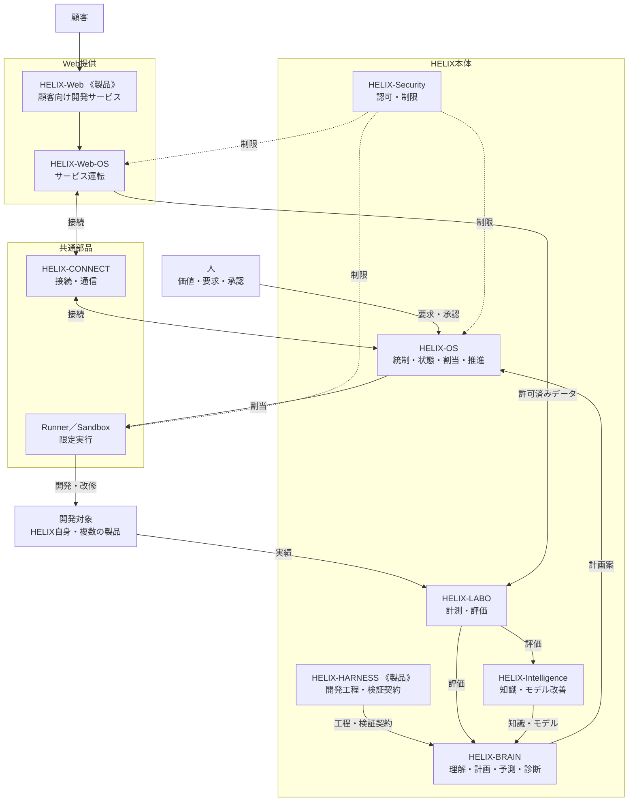

# HELIX Concept

> 版: v4.3 ／ status: current
> HELIXがどんなシステムで、どんな構想を持ち、どんな機構で成り立つかを定める。本書は他の文書を参照しない。
> 製品定義・要求・目標や原則の詳細は、本書に紐づけて下位に置く。版ごとにファイルを分けず、本ファイルをその場で改訂する。
>
> 改訂履歴
> - v4.3 (2026-09-24) — 8機構＋2共通部品へ再編した。HELIX自身・複数製品・Web提供・データ還流の循環を明示した。1ファイルでその場改訂する形へ移行した。
> - v4.2 (2026-09-24) — 自走、全体simulation、非エンジニア利用、Worker最適配置の責務を明確化した。
> - v4.1 (2026-09-17) — HARNESS、OS、Web、Web-OSを分離した。

## 1. どんなシステムか

HELIXは、人が決めた価値と要求を起点に、AIが開発・検証・運用・改善を自走する開発システムである。
同じ開発能力を、HELIX自身と複数の製品へ適用し、その実績から製品とHELIXの両方を育て続ける。
内部で実証した能力は、Webを通じて顧客にも提供する。

中心価値は、**ソフトウェアの所有者が、自分のシステムを自分で育て続けられること**にある。

| 担い手 | 持つもの |
|---|---|
| 人 | 価値、企画、要求、体験、要件の承認、不可逆な操作の許可 |
| HELIX（AI） | 承認された範囲の分解、設計、実装、検証、統合、運用、改善候補づくり |

## 2. どんな構想か

### 5大目標

1. **システム駆動エージェント自走システム** — 会話や記憶ではなく、上流の決定と工程契約に沿ってAIが自走する。
2. **開発するほど賢くなる自己知能型改善システム** — 実績を計測し、知識とモデルを育てる。学習結果が要求や承認を直接書き換えない。
3. **設計から全体をシミュレーションする予測型システム** — 設計と状態から影響を予測し、前提と不確実性を示して実測と照らす。
4. **CIとbotで品質とスピードを両立した非エンジニアでも作れるシステム** — 自動検査と差戻しを、人が目的・進行・判断事項を理解できる入口へつなぐ。
5. **低コストワーカでも最高のパフォーマンスを発揮して最適配置するシステム** — 品質・費用・手戻りの実測で配置を決め、名前や価格だけで決めない。

### 成長の循環

1. HELIXでHELIX自身を開発・改修する。
2. 同じ開発能力を、性質の異なる複数の製品へ投入する。
3. 製品の結果はまずその製品へ戻し、HELIX側の欠陥はHELIXの自己改善へ戻す。
4. 内部で実証した開発・保守改修の能力を、Webで顧客へ提供する。
5. 許可されたWebデータを計測・学習し、改善したHELIXを内部利用とWeb提供へ戻す。

### 段階

- **Version 1** はHELIX-HARNESSの完成である。複数の製品とHELIX自身で、要求から受入・運用評価まで通ることで完成とする。
- **HELIX-Web** はVersion 1の完成後に展開する。
- 外部知見の推薦、ローカルLLMの調整、動的な開発フロー、System Compilerは将来の能力であり、Version 1の完成範囲に含めない。

## 3. どんな機構で成り立つか

HELIXは8つの機構と2つの共通部品から成る。**製品は機構の一部**であり、HARNESSとWebだけが製品の属性を持つ。

| 機構 | 役割 | しないこと |
|---|---|---|
| HELIX-HARNESS 《製品》 | V-model、要求形成・設計・検証・受入の契約、外部へ提供する開発基盤 | 作業の割当、実行状態の管理 |
| HELIX-OS | HELIX自身と各製品の要求・承認・予算・状態の管理、割当、統合、更新、復旧、推進 | 工程の意味の別定義、BRAIN案の無条件実行 |
| HELIX-BRAIN | 稼働中の理解、計画、予測、診断、レビュー、配置案 | 要求・承認・権限の生成、OS状態の直接更新 |
| HELIX-LABO | 実験、比較、改善効果・退行の計測 | 自己評価だけでの採用確定 |
| HELIX-Intelligence | 経験・知識・判断方法・モデルの改善 | 検証なしでの稼働モデル差し替え |
| HELIX-Security | 認可、情報保護、資格情報、隔離、失効 | 自身の権限の拡張 |
| HELIX-Web 《製品》 | 顧客向けの開発・保守改修サービス | 開発エンジンの別実装 |
| HELIX-Web-OS | 顧客のtenant・job・サービス状態・配備・監視・復旧 | 内部OSの状態・鍵・権限の共有 |
| HELIX-CONNECT（共通部品） | 接続登録、契約版の照合、通信、再送、追跡 | 業務判断、承認 |
| Runner／Sandbox（共通部品） | 限定された実行、停止、隔離、結果回収 | 作業の採否、自己承認 |

- **BRAINは考え、Intelligenceは育てる。** 稼働時の判断はBRAIN、その判断能力を育てるのはIntelligenceである。
- **決めるのはOS。** BRAINは案を出し、OS内の推進機構が作業を生成し、OSの管理が確定する。検収は独立して行う。
- **管理・推進・検収を、同じ自己承認主体にまとめない。**
- 開発の層は、Concept → 要求（L1）→ 要件（L2）→ 設計 → 実装 → 検証 → 受入・運用評価の順に降り、`L1↔L12`、`L2↔L11`、`L3↔L10`、`L4↔L9`、`L5↔L8`、`L6↔L7`で対にする。

## 4. 原則

1. **人が決める** — 要求、承認、判断を、誰が・何に・どの版で行ったかに結びつける。
2. **責務を分ける** — 機構ごとの責務と、製品固有の価値・要求を混ぜない。
3. **上から下へ導く** — Conceptから要求、要件、設計、実装、運用へ一方向に導く。
4. **責任者は一つ** — 一つの振る舞いには、主たる責任者を一つだけ置く。
5. **AIの実行を縛る** — Workerを、割当、branch、期限、予算、権限の範囲で動かす。
6. **証拠で閉じる** — 対象の版、実体、独立レビュー、結果の読み直しで完了を判定する。
7. **再構築できる** — 意味の正本、実行事実、表示、作業文脈を分けて保つ。
8. **学びは候補として戻す** — 学習や監査の結果は上流への提案とし、正本を直接書き換えない。
9. **検証済みの単位で出す** — 検証済みの機能から提供構成を組み、releaseとdeploymentを分ける。

守ること:

- Issue、PR、CI、会話から、要求の意味や人の承認を生み出さない。
- 不明を「問題なし」に読み替えない。
- 自分の作業を自分でレビューして、独立レビューの代わりにしない。
- 要求・実装・検証・受入・運用を、一つの「完了」にまとめない。
- 機構の停止や交換で、認可・品質・証拠・復旧条件を失わない。
- Webの画面表示だけで、開発サービスが成立したとみなさない。
