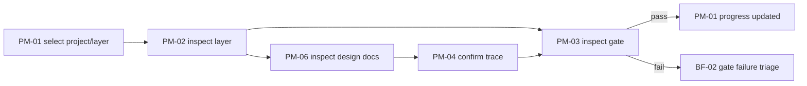
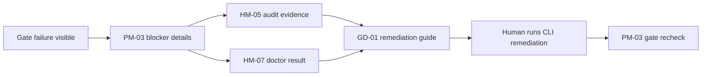

# L2 業務フロー設計

この文書は、HELIX harness に対する user / business の swimlane view（業務レーン視点）を追加する。[screen-flow.md](./screen-flow.md) が UI navigation edge を定義するのに対し、ここでは誰が何を行い、どの system artifact に触れ、どの画面が人間の判断を支援するかに焦点を置く。

## 1. Actor と Lane（役割とレーン）

| Lane（レーン） | Actor（主体） | 責務 | UI Surface（UI 面） |
|---|---|---|---|
| PO | Product owner または decision maker | gate を承認し、next action を確認し、scope と progress を確認する。 | PM-01, PM-03, PM-05, PM-06 |
| TL / Operator | Human technical lead または harness operator | command を実行し、doctor / audit / recovery を確認し、runtime handover を調整する。 | PM-02, PM-04, HM-01..HM-08 |
| AI Runtime | Codex / Claude Code process | CLI-mediated task を通じて design、implementation、review、verification の output を作る。 | 直接 UI 操作なし |
| HELIX Core | CLI, validators, doctor, plan lint, vmodel lint, projection writers | workflow を強制し、machine evidence を生成し、drift 時は fail-close する。 | PM/HM 画面に反映 |
| Repository / GitHub | Git history, PR, checks, actions, review evidence | canonical artifact と CI evidence を永続化する。 | PM-03, HM-05, GD-01 |
| Docs / DB | Markdown design docs, test design docs, `.helix` state, `harness.db` | readable design source と queryable runtime projection を提供する。 | PM-04, PM-06, HM-04 |

## 2. フロー一覧

| Flow ID | 名称 | Trigger（契機） | Primary Screens（主画面） | Output / Decision（出力・判断） |
|---|---|---|---|---|
| BF-01 | Forward 設計から実装へのレビュー | plan が Forward `plan -> pair-freeze -> implement -> trace-freeze -> review -> accept` を進む。 | PM-01, PM-02, PM-03, PM-04, PM-06 | Gate pass/fail と next action。 |
| BF-02 | Gate failure（gate 失敗）の切り分け | gate、doctor check、lint、review のいずれかが失敗する。 | PM-03, HM-05, HM-07, GD-01 | 人間が読める blocker と remediation command text。 |
| BF-03 | Handover and resume（引き継ぎと再開） | Runtime が切り替わる、session が再開する、または stale handover が検出される。 | PM-05, PM-02, PM-03, HM-05 | stale ではない next action と resumed work context。 |
| BF-04 | Recovery / incident correction（復旧・incident 是正） | incorrect claim、interrupted run、broken state、rollback candidate のいずれかが現れる。 | HM-06, PM-03, HM-05, HM-07 | recovery decision、resume point、または escalation。 |
| BF-05 | Coverage gap discovery（coverage gap 検出） | coverage / trace / implementation status が弱い artifact または欠落 artifact を示す。 | HM-02, HM-01, PM-04, PM-06 | 新しい plan / task candidate と trace target。 |
| BF-06 | Design document review（設計文書レビュー） | PO / TL が gate decision 前に canonical design docs を確認する必要がある。 | PM-06, PM-04, GD-01 | Doc review outcome と trace confirmation。 |

## 3. Swimlane フロー

### BF-01 Forward 設計から実装へのレビュー

| 手順 | PO | TL / Operator | AI Runtime | HELIX Core | Docs / DB | Screen |
|---:|---|---|---|---|---|---|
| 1 | inspect する project / layer を選択する。 | active plan scope を確認する。 | - | plan registry / projection を読む。 | 現在の plan / doc state を提供する。 | PM-01 -> PM-02 |
| 2 | design / readiness を確認する。 | pair-freeze evidence を実行または確認する。 | CLI 経由で design / review output を作る場合がある。 | plan / vmodel rule を強制する。 | design docs / test docs を更新する。 | PM-02, PM-06 |
| 3 | gate status を開く。 | failing / passing evidence を確認する。 | - | gate result と next_action を出力する。 | evidence path を保存する。 | PM-03 |
| 4 | trace が十分であることを確認する。 | upstream / downstream edge を確認する。 | 新しい plan 経由で missing artifact を修復する場合がある。 | trace graph を検証する。 | trace / projection を更新する。 | PM-04 |
| 5 | accept する、または差し戻す。 | review evidence を記録する。 | approved path 経由でのみ implement / remediate する。 | status を更新する。 | result を永続化する。 | PM-03 -> PM-01 |

### BF-02 Gate failure の切り分け

| 手順 | PO | TL / Operator | AI Runtime | HELIX Core | Repository / GitHub | Screen |
|---:|---|---|---|---|---|---|
| 1 | failed gate または赤い project cell を見る。 | blocker details を開く。 | - | failure classification を出力する。 | check / log link を提供する。 | PM-01 -> PM-03 |
| 2 | next_action と impact を確認する。 | audit / doctor evidence を開く。 | - | error を gate / check に対応付ける。 | failed run evidence を保存する。 | PM-03, HM-05, HM-07 |
| 3 | remediation / escalation を選ぶ。 | CLI command を copy する、または guide を開く。 | human / operator が CLI で呼び出した場合のみ実行する。 | rerun 後に remediation を検証する。 | PR / check state が変わる。 | GD-01, PM-03 |
| 4 | gate を再確認する。 | pass を確認する、または blocker を open のままにする。 | - | gate status を更新する。 | evidence が link される。 | PM-03 |

### BF-03 Handover と resume

| 手順 | PO | TL / Operator | AI Runtime | HELIX Core | Docs / DB | Screen |
|---:|---|---|---|---|---|---|
| 1 | current session state を開く。 | handover が stale かどうかを確認する。 | previous runtime が CURRENT.json を作っている場合がある。 | handover pointer と session digest を読む。 | CURRENT.json と archive を保存する。 | PM-05 |
| 2 | 次の work target を確認する。 | target layer / gate へ移動する。 | new runtime は CLI / session context 経由で handover を消費する。 | next_action target を解決する。 | plan / doc link を提供する。 | PM-05 -> PM-02/PM-03 |
| 3 | work を継続する。 | continuation 後の evidence を検証する。 | assigned role 経由で変更を作る。 | log / projection を更新する。 | handover / audit を更新する。 | PM-03, HM-05 |

### BF-04 Recovery / incident correction の判断

| 手順 | PO | TL / Operator | AI Runtime | HELIX Core | Repository / GitHub | Screen |
|---:|---|---|---|---|---|---|
| 1 | incorrect completion、stuck run、broken state のいずれかに気づく。 | recovery view を開く。 | - | recovery candidate と constraint を表示する。 | 影響を受ける commit / check を提供する。 | HM-06 |
| 2 | safe resume / rollback option を確認する。 | audit と doctor output を確認する。 | decision 後に remediation role を割り当てられる場合がある。 | destructive または ambiguous な path を block する。 | evidence は link されたまま残る。 | HM-06, HM-05, HM-07 |
| 3 | recovery route を決める。 | approved CLI command を実行する、または recovery plan を開く。 | role の範囲内で実行する。 | status を再検証する。 | 新しい evidence を commit / record する。 | PM-03, HM-06 |

### BF-05 Coverage gap の発見

| 手順 | PO | TL / Operator | AI Runtime | HELIX Core | Docs / DB | Screen |
|---:|---|---|---|---|---|---|
| 1 | coverage heatmap または project overview を確認する。 | weak coverage cell を開く。 | - | missing artifact / trace を集約する。 | projection row を提供する。 | HM-02 |
| 2 | missing FR / artifact / screen relation を特定する。 | feature list と trace view を開く。 | - | FR を plan / doc / screen に対応付ける。 | relation graph を読む。 | HM-01, PM-04 |
| 3 | target design doc を開く。 | 必要に応じて new plan を作成または route する。 | plan approval 後に implement する場合がある。 | plan requirement を強制する。 | docs / projection を更新する。 | PM-06, PM-02 |

### BF-06 Design document の確認

| 手順 | PO | TL / Operator | AI Runtime | HELIX Core | Docs / DB | Screen |
|---:|---|---|---|---|---|---|
| 1 | design doc tree を開く。 | layer / sub-doc を選択する。 | - | doc catalog を読む。 | Markdown / frontmatter を提供する。 | PM-06 |
| 2 | content と trace link を確認する。 | 必要に応じて trace graph を開く。 | - | trace key を解決する。 | upstream / downstream reference を提供する。 | PM-06 -> PM-04 |
| 3 | decision を記録する、または remediation を要求する。 | gate を開く、または follow-up plan を作る。 | routing 後にのみ実行する。 | status / gate を更新する。 | evidence が link される。 | PM-03 |

## 4. Business Flow と UI transition の対応

| Business Flow | Screen Flow シナリオ | 必須 Edge |
|---|---|---|
| BF-01 | S1 Forward normal、PM-06 の支援 navigation | PM-01 -> PM-02 -> PM-03 -> PM-01; PM-02/PM-04 -> PM-06 |
| BF-02 | S2 Gate fail next_action の確認 | PM-03 -> HM-05 -> GD-01 -> PM-03 |
| BF-03 | S4 Session resume | PM-05 -> PM-02 -> PM-03 -> PM-01 |
| BF-04 | S3 Incident | PM-01 -> HM-06 -> HM-05 -> PM-01; HM-06 -> PM-03 |
| BF-05 | S5 Weak point diagnosis | HM-02 -> HM-01 -> GD-01; HM-01 -> PM-06 |
| BF-06 | PM-06 supporting navigation | PM-06 -> PM-04 -> PM-03 |

## 5. Coverage 確認

- 各 business flow は少なくとも 1 つの primary screen と 1 つの decision / output を持つ。
- business flow が使う各 transition は `screen-flow.md` に存在するか、supporting navigation edge として明示されている。
- 各 human decision point には、log file だけではなく visible evidence を示す screen がある。
- 各 AI / runtime action は CLI、plan routing、gate evidence のいずれかで仲介される。UI direct execution は導入しない。
- recovery と destructive operation は human decision を必須とし、copyable command text のみを表示する。

## 6. Carry

- L10 UX refinement では、各 business flow が hidden navigation なしで完了できるかを検証する。
- PM-06 は business-flow docs を screen-flow docs の隣に表示し、PO が workflow narrative を確認できるようにする。
- future implementation では、daily operation と failure recovery を覆う BF-01、BF-02、BF-03、BF-05 の screenshot evidence を先に追加する。
