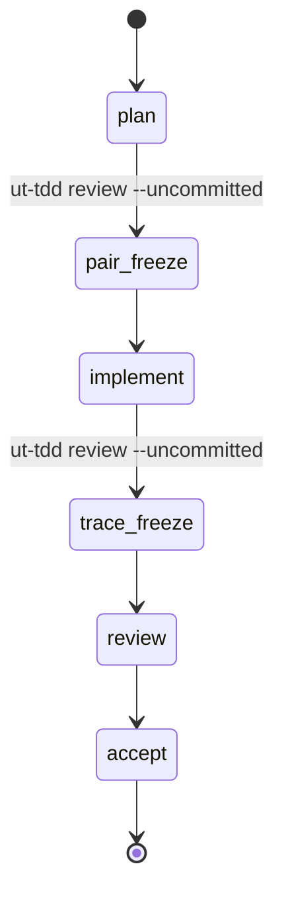
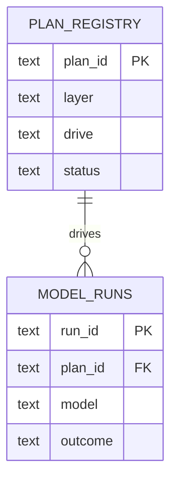

# design doc（設計ドキュメント）

UT-TDD design doc の一部として Mermaid / D2 diagram をいつ、どのように作るかを扱う。
diagram は illustration ではなく versioned design artifact であり、prose と同じ freeze readability check を通す。

## この skill を読む条件

- component structure、data flow、API sequence、state transition を説明する L2-L5 の
  `docs/design/` doc を作成する。
- system boundary または data model に関わる decision を含む ADR を書く。
- Reverse R2 pass で as-is architecture を capture する。

## Mermaid と D2

V-model layer docs では inline Mermaid を default にする。
layout control が必要な場合、または diagram が複数 doc から参照される場合（single source of truth）だけ
D2 source file（`docs/diagrams/`）へ昇格する。
generated SVG と一緒に D2 source を commit する。SVG だけを commit しない。

## layer 別 diagram obligation

- **L2 (screen/IA):** screen-flow または component-hierarchy `flowchart`。
- **L3 (functional):** stateful feature ごとの state-transition diagram。
  API surface ごとの sequence diagram。
- **L4 (basic):** module component diagram。DB 変更では ER diagram。
- **L5 (detailed):** class / data boundary が非自明な場合のみ optional。

## Mermaid の template（UT-TDD context）

PLAN lifecycle state:

harness.db projection (ER):

## Freeze diagram の checklist

- [ ] すべての diagram に、何を示すかを述べる 1 文 caption がある。
- [ ] Mermaid が error なしで compile する（local で preview）。
- [ ] node label が L0 glossary と doc 本文の terminology に一致する。
- [ ] D2 source が referencing doc と一緒に commit されている。
- [ ] diagram だけに decision を置いていない。decision は prose で述べ、diagram はそれを illustrate する。
- [ ] Reverse R2 diagram は "as-is" と label され、date が付いている。

diagram 追加後は `ut-tdd review --uncommitted` を実行する。
diagram が必須の layer は、"TODO: add diagram" placeholder が残ったまま pair-freeze へ到達できない。
